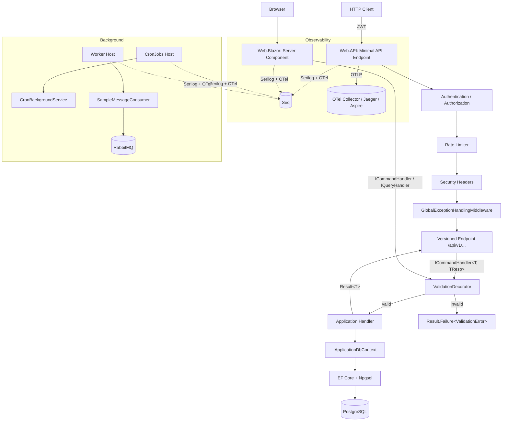
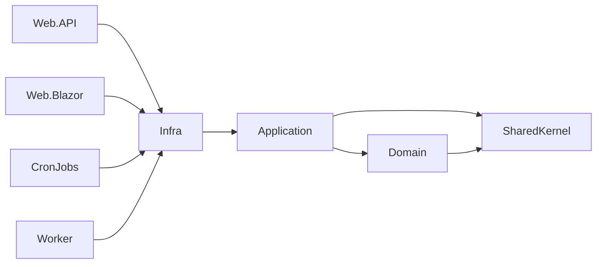
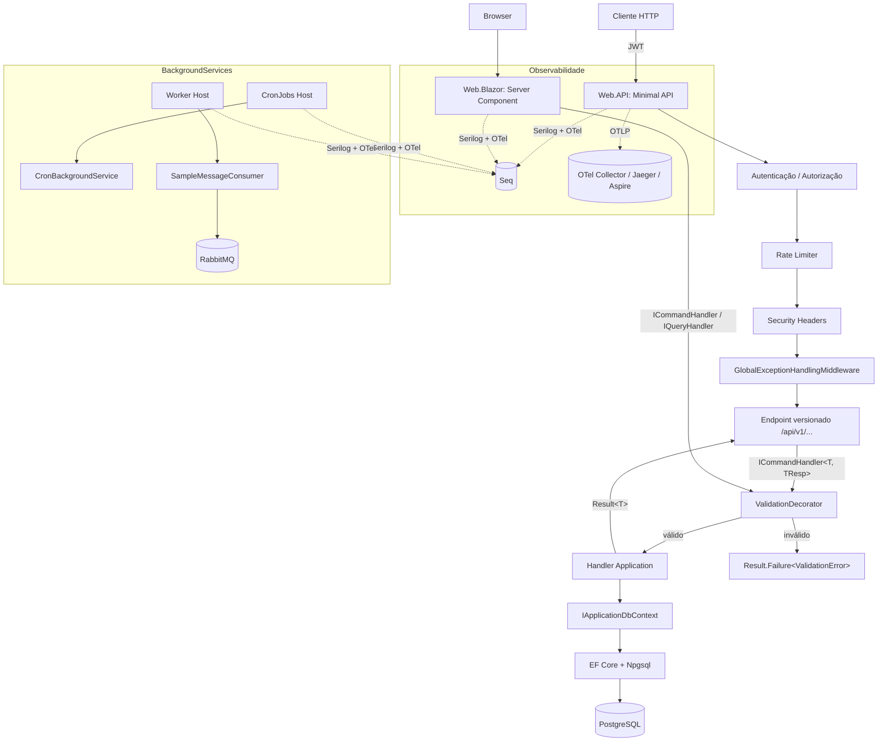

# StayTraining

.NET 10 Clean Architecture / DDD scaffold with EF Core + PostgreSQL, JWT auth, Serilog + Seq, OpenTelemetry, FluentValidation, xUnit/Shouldly/Moq/NetArchTest, four entrypoints (Web.API, Web.Blazor, CronJobs, Worker) and shared RabbitMQ messaging.

---

## 🇬🇧 English

### Stack

- .NET 10 (LTS), C# 14, Central Package Management
- ASP.NET Core Minimal APIs + `Asp.Versioning` 10
- Blazor Server (Interactive Server render mode)
- EF Core 10 + Npgsql + snake_case naming
- JWT Bearer Authentication
- Serilog (Console + Seq) + structured request logging
- **OpenTelemetry** (traces + metrics, OTLP exporter)
- FluentValidation (pipeline via Scrutor `TryDecorate`)
- xUnit + Shouldly + Moq + NetArchTest + `Microsoft.AspNetCore.Mvc.Testing`
- RabbitMQ.Client 7.x (async)
- Cronos (cron expressions)
- Docker Compose (postgres, rabbitmq, seq, web.api, web.blazor, worker, cronjobs)

### Project layout

```
src/
├── SharedKernel/                # Result, Error, Entity, Enumeration
├── Domain/                      # Aggregates, domain errors (no deps)
├── Application/                 # Use cases, ICommandHandler/IQueryHandler, validators
├── Infra/                       # EF Core, ApplicationDbContext, auth, RabbitMQ publisher
│   ├── Messaging/               # RabbitMqConnectionFactory, RabbitMqMessagePublisher
│   └── Observability/           # OpenTelemetryExtensions
└── EntryPoints/
    ├── Web.API/                 # Minimal APIs, middleware, versioning
    ├── Web.Blazor/              # Blazor Server (Interactive Server components)
    ├── CronJobs/                # BackgroundService + Cronos scheduler
    └── Worker/                  # RabbitMQ consumer BackgroundService

tests/
├── Domain.UnitTests/
├── Application.UnitTests/
└── Web.API.IntegrationTests/    # WebApplicationFactory + architecture tests
```

### Prerequisites

- .NET 10 SDK (`global.json` pins `10.0.203`, `latestFeature` rollForward)
- Docker + Docker Compose (for Postgres / RabbitMQ / Seq)
- `dotnet-ef` optional for migrations

### Installation

```bash
git clone git@github.com:DiegoModesto/scaffold-backend.git
cd scaffold-backend

# restore + build (uses repo-local .nuget-cache/, gitignored)
dotnet restore
dotnet build StayTraining.sln

# run tests (35 across 3 suites)
dotnet test StayTraining.sln
```

> NuGet uses a repo-local `.nuget-cache/` configured in `nuget.config`. Delete it for a clean restore.

### Required environment variables

The base `appsettings.json` ships with empty secrets on purpose. Provide them via environment variables (or user-secrets in dev):

| Variable                       | Description                                     | Required        |
|--------------------------------|-------------------------------------------------|-----------------|
| `DB_CONNECTION_STRING`         | Postgres connection string                      | ✅              |
| `Auth__Authority`              | Auth.API base URL (e.g. `http://auth.api:8080`) | ✅              |
| `Auth__IntrospectionEndpoint`  | Full URL of `/connect/introspect`               | ✅              |
| `Auth__IntrospectionClientId`  | OpenIddict resource server id (default `web-api`) | ✅            |
| `Auth__IntrospectionClientSecret` (`OPENIDDICT_WEB_API_SECRET`) | Secret for the `web-api` resource server | ✅ |
| `Redis__ConnectionString`      | Optional — enables introspection cache          | optional        |
| `IntrospectionCache__TtlSeconds` | Introspection cache TTL (default 30s)         | optional        |
| `RABBITMQ_HOST`                | RabbitMQ host                                   | Worker / publishers |
| `RABBITMQ_USER`                | RabbitMQ user                                   | Worker / publishers |
| `RABBITMQ_PASSWORD`            | RabbitMQ password                               | Worker / publishers |
| `OTEL_EXPORTER_OTLP_ENDPOINT`  | OTLP collector endpoint (e.g. `http://localhost:4317`) | optional |

> `appsettings.Development.json` already provides safe local defaults for `dotnet run`.

### Running locally

**Option A — Docker Compose (everything):**

```bash
docker compose up -d
# Web.API     → http://localhost:5000
# Web.Blazor  → http://localhost:5002
# Seq         → http://localhost:5341
# RabbitMQ    → http://localhost:15672  (guest/guest)
# Postgres    → localhost:5432
```

**Option B — Services via Compose, apps via `dotnet run`:**

```bash
docker compose up -d postgres rabbitmq seq
dotnet run --project src/EntryPoints/Web.API     # https://localhost:xxxx/swagger
dotnet run --project src/EntryPoints/Web.Blazor  # Blazor UI
dotnet run --project src/EntryPoints/CronJobs    # cron-based background jobs
dotnet run --project src/EntryPoints/Worker      # RabbitMQ consumer
```

### EF Core migrations

```bash
# create a migration
dotnet ef migrations add <Name> \
  --project src/Infra \
  --startup-project src/EntryPoints/Web.API \
  --output-dir Database/Migrations

# apply to db
dotnet ef database update \
  --project src/Infra \
  --startup-project src/EntryPoints/Web.API
```

### Testing

```bash
dotnet test StayTraining.sln                                       # everything (35 tests)
dotnet test tests/Application.UnitTests/Application.UnitTests.csproj      # unit
dotnet test tests/Web.API.IntegrationTests/...                            # integration + architecture
```

Integration tests use `WebApplicationFactory<Program>` with an in-memory EF provider and a WireMock server impersonating Auth.API's introspection endpoint — no external services required. Use `factory.IssueTestToken(tenantId, subjectId, "sample.read", "sample.write")` to mint opaque tokens whose introspection responses carry the requested permissions.

### Observability — OpenTelemetry

All four entrypoints share a single composition helper at `Infra.Observability.OpenTelemetryExtensions`:

```csharp
services.AddOpenTelemetryObservability(
    configuration,
    serviceName: "Web.API",
    includeAspNetCore: true);   // false for Worker / CronJobs
```

What's wired:

- **Tracing**: HttpClient, EF Core, Npgsql, ASP.NET Core (when applicable), plus a per-service `ActivitySource`.
- **Metrics**: runtime, HttpClient, ASP.NET Core (when applicable).
- **Exporter**: OTLP, enabled when `OpenTelemetry:OtlpEndpoint` or `OTEL_EXPORTER_OTLP_ENDPOINT` is set. No exporter ⇒ no-op (good for dev).

Point a collector at `http://localhost:4317` (Jaeger, .NET Aspire dashboard, OTel Collector, Seq with OTLP receiver, etc.) to see traces and metrics flow.

### Security highlights

- Web.API validates **opaque reference tokens** by introspecting against Auth.API (`OpenIddict.Validation.AspNetCore` + `SystemNetHttp`). No JWT signing key lives in Web.API anymore.
- Optional Redis-backed introspection cache (`Infra.Authentication.IntrospectionCachingHandler`) shared with the Gateway; TTL defaults to 30s — short enough to honour token revocation.
- `IUserContext.TenantId` is resolved from the `tenant_id` claim, falling back to the `X-Forwarded-TenantId` header set by the Gateway. Production deployments must lock down inbound traffic so only the Gateway can set the header.
- Endpoints declare permission policies (`RequireAuthorization("permission:sample.read")`) — the dynamic `PermissionPolicyProvider` lives in `Infra.Authorization` and is shared with Auth.API.
- Security headers middleware: `X-Content-Type-Options`, `X-Frame-Options`, `Referrer-Policy`, `Permissions-Policy`, `Cross-Origin-Opener-Policy`
- HSTS + HTTPS redirection outside Development
- Configurable CORS (`Cors:AllowedOrigins`)
- Global rate limiter (fixed window, 100 req/min per identity)
- `GlobalExceptionHandlingMiddleware` never leaks stack traces

### Navigation / request flow



### Layered dependency rules (enforced by architecture tests)



- `Domain` has **no** dependencies on Application / Infra / EF Core
- `Application` has **no** dependencies on Infra / ASP.NET Core
- `Infra` has **no** dependency on Web.API
- All command/query handlers must be `sealed`
- All endpoints must be `sealed`
- Concrete `IMessagePublisher` implementations must live in `Infra` (not in any entrypoint)

### Adding a new use case

1. Create command/query record in `src/Application/<Feature>/<Action>/`
2. Create handler (`public sealed` + `ICommandHandler<T, TResp>` or `IQueryHandler<T, TResp>`)
3. Create `AbstractValidator<T>` for validation (optional but recommended)
4. Add endpoint in `src/EntryPoints/Web.API/Endpoints/<Feature>/` implementing `IEndpoint` (or inject the handler in a Razor component for Web.Blazor)
5. Inject the **interface** (not the concrete handler) so the ValidationDecorator runs
6. Write unit tests in `Application.UnitTests` + integration tests in `Web.API.IntegrationTests`

### Authentication (Auth.API)

`Auth.API` is a **standalone identity service** running as its own bounded context, with a dedicated Postgres database (`auth_db`) and Redis cache. It is independent from the rest of the scaffold's `ApplicationDbContext` and is composed of `Auth.Domain` + `Auth.Application` + `Auth.Infra`.

Highlights:

- Federates **Microsoft Entra ID (OIDC)** for human users.
- Issues **opaque reference tokens** — resource servers validate them through `POST /connect/introspect`.
- **Multi-tenant** with **JIT (Just-In-Time) user provisioning** based on the Entra `tid` claim and a local `Tenants` table.
- Built on **OpenIddict** as the OAuth2 / OIDC server, with EF Core stores in `auth_db`.
- **SAML SSO to NetSuite** is planned in Plan 4 of the auth roadmap.
- Hosted services seed OpenIddict clients (`bff-blazor`, `web-api`, `gateway`) and default permissions on startup.

Run it locally:

```bash
docker compose up -d auth-postgres redis auth.api
# Auth.API discovery → http://localhost:5100/.well-known/openid-configuration
# Auth.API health    → http://localhost:5100/health/live
```

Required environment variables (see also the table above):

- `ConnectionStrings__AuthDb` (or `AUTH_DB_CONNECTION_STRING`)
- `Redis__ConnectionString`
- `ENTRA_TENANT_ID`, `ENTRA_CLIENT_ID`, `ENTRA_CLIENT_SECRET`, `ENTRA_AUTHORITY`
- `OPENIDDICT_BFF_SECRET`, `OPENIDDICT_WEB_API_SECRET`, `OPENIDDICT_GATEWAY_SECRET`

Reference docs:

- Spec: [`docs/superpowers/specs/2026-05-06-sso-auth-design.md`](docs/superpowers/specs/2026-05-06-sso-auth-design.md)
- Plan: [`docs/superpowers/plans/2026-05-06-auth-api-core.md`](docs/superpowers/plans/2026-05-06-auth-api-core.md)

### Gateway (YARP)

`Gateway` is the **single ingress** for backend traffic. It sits in front of `Auth.API` and `Web.API`, validates opaque reference tokens via `POST /connect/introspect`, caches the result in Redis, and forwards a normalized identity downstream.

Highlights:

- Built on **YARP** with all routes / clusters bound from `ReverseProxy:*` configuration (env-var-friendly, see `compose.yaml`).
- Routes external clients to Auth.API (`/api/auth/.well-known/*`, `/api/auth/connect/*`) and Web.API (`/api/v1/*`).
- Validates tokens via the **OpenIddict introspection endpoint** with a **Redis-backed cache** (default TTL 30s) — drop-in replacement for hammering Auth.API on every request.
- Forwards the canonical identity to downstream services via `X-Forwarded-User` and `X-Forwarded-TenantId` headers (consumed by Web.API in Plan 5).
- Health checks: `/health/live` (process) and `/health/ready` (Redis + Auth.API discovery).

Run it locally:

```bash
docker compose up -d redis auth-postgres auth.api gateway
# Gateway discovery (proxied)  → http://localhost:5200/api/auth/.well-known/openid-configuration
# Gateway health (live/ready)  → http://localhost:5200/health/live
```

Required environment variables (see `compose.yaml` and §9 of `CLAUDE.md`):

- `Auth__Authority`, `Auth__IntrospectionEndpoint`
- `Auth__IntrospectionClientId` (defaults to `gateway`) and `Auth__IntrospectionClientSecret` (`OPENIDDICT_GATEWAY_SECRET`)
- `Redis__ConnectionString`
- `IntrospectionCache__TtlSeconds` (defaults to `30`)
- `ReverseProxy__Routes__*` and `ReverseProxy__Clusters__*` for YARP routing

Reference docs:

- Plan: [`docs/superpowers/plans/2026-05-07-gateway-yarp.md`](docs/superpowers/plans/2026-05-07-gateway-yarp.md)

### Web.Blazor (BFF)

`Web.Blazor` is the **backoffice BFF**: a Blazor Server app that talks to Auth.API as an OIDC client (client_id `bff-blazor`, code+PKCE+secret) and stores the resulting access/refresh/id tokens server-side in Redis under a session id carried by an HttpOnly cookie. The browser never sees the access token.

Highlights:

- **Cookie session** (HttpOnly, SameSite=Lax) tied to a Redis-backed token store. The OIDC handler's `OnTokenValidated` mints a `session_id` claim, persists `(access, refresh, id)` against it, and the cookie carries the `session_id` opaquely.
- **Federated identity via Auth.API** (OpenIddict). Web.Blazor never authenticates users itself — it redirects to the Auth.API authorize endpoint and consumes the resulting tokens.
- **Admin pages** (MudBlazor) for users / groups / roles / permissions / M2M clients / audit. Each page calls Auth.API admin endpoints through the Gateway via `IAdminGatewayClient` (typed `HttpClient`) and gates UI on permission claims with `<PermissionView Permission="...">`.
- No direct DB access, no JWT signing key, no RabbitMQ. The BFF only depends on Redis (token store + DataProtection keys) and the Gateway (which fans out to Auth.API).

Run it locally:

```bash
docker compose up -d redis auth-postgres auth.api gateway web.blazor
# Web.Blazor → http://localhost:5002 (click "Login" to start the OIDC dance)
```

Required environment variables (see `compose.yaml`):

- `Auth__Authority` (e.g. `http://auth.api:8080`), `Auth__ClientId=bff-blazor`, `Auth__ClientSecret` (`OPENIDDICT_BFF_SECRET`)
- `Redis__ConnectionString`
- `Gateway__BaseUrl` (e.g. `http://gateway:8080`)

Reference docs:

- Plan: [`docs/superpowers/plans/2026-05-07-blazor-bff.md`](docs/superpowers/plans/2026-05-07-blazor-bff.md)

### NetSuite SAML outbound SSO (Plan 4)

Auth.API can sign SAML 2.0 assertions and POST them to NetSuite so an authenticated backoffice user is dropped straight into NetSuite, no second password prompt. The flow is **IdP-initiated only** in V1 (no SP-initiated, no SLO, no encrypted assertions).

How it works:

1. The BFF user navigates to `/admin/users/{id}/netsuite-redirect` (gated by `users.write`).
2. Web.Blazor calls `POST /api/auth/saml/netsuite/initiate` (with `target_user_id`) through the Gateway with their bearer token.
3. Auth.API resolves the target user, validates `NetSuiteEmail` is set, builds + signs a `<saml:Assertion>` with `ITfoxtec.Identity.Saml2` (RSA-SHA256), and returns a tiny HTML page whose body auto-POSTs the base64-encoded SAMLResponse to `https://system.netsuite.com/saml2/acs?account={AccountId}`.
4. The browser executes the POST and lands inside NetSuite as the matching user.

Local dev:

```bash
# Run once — generates src/EntryPoints/Auth.API/dev-certs/netsuite-saml.pfx (gitignored)
bash scripts/generate-dev-saml-cert.sh

# compose mounts dev-certs/ at /app/dev-certs:ro and provides safe defaults for the
# NetSuite__* env vars. The actual POST will fail at NetSuite without a real account
# configured, but you can verify the assertion is generated and submitted.
docker compose up -d redis auth-postgres auth.api gateway web.blazor
```

Production:

- Provision the signing PFX through your secret store and mount it at `NetSuite__SamlSigningCertificatePath`.
- Export the matching X.509 public certificate and upload it to NetSuite under `Setup → Integration → SAML Single Sign-on`.
- Configure NetSuite's IdP entityId to match `NetSuite__SamlIssuer` exactly (byte-for-byte).
- Set every user's `NetSuiteEmail` (via the BFF admin UI) to the email of their NetSuite account.

Reference docs:

- Plan: [`docs/superpowers/plans/2026-05-07-netsuite-saml.md`](docs/superpowers/plans/2026-05-07-netsuite-saml.md)

---

## 🇧🇷 Português

### Stack

- .NET 10 (LTS), C# 14, Central Package Management
- ASP.NET Core Minimal APIs + `Asp.Versioning` 10
- Blazor Server (modo de renderização Interactive Server)
- EF Core 10 + Npgsql + convenção snake_case
- JWT Bearer Authentication
- Serilog (Console + Seq) + request logging estruturado
- **OpenTelemetry** (traces + métricas, exporter OTLP)
- FluentValidation (pipeline via Scrutor `TryDecorate`)
- xUnit + Shouldly + Moq + NetArchTest + `Microsoft.AspNetCore.Mvc.Testing`
- RabbitMQ.Client 7.x (API assíncrona)
- Cronos (expressões cron)
- Docker Compose (postgres, rabbitmq, seq, web.api, web.blazor, worker, cronjobs)

### Estrutura

```
src/
├── SharedKernel/                # Result, Error, Entity, Enumeration
├── Domain/                      # Agregados, erros de domínio (sem dependências)
├── Application/                 # Casos de uso, handlers, validators
├── Infra/                       # EF Core, ApplicationDbContext, auth, publisher RabbitMQ
│   ├── Messaging/               # RabbitMqConnectionFactory, RabbitMqMessagePublisher
│   └── Observability/           # OpenTelemetryExtensions
└── EntryPoints/
    ├── Web.API/                 # Minimal APIs, middleware, versionamento
    ├── Web.Blazor/              # Blazor Server (Interactive Server)
    ├── CronJobs/                # BackgroundService + agendador Cronos
    └── Worker/                  # Consumer RabbitMQ em BackgroundService

tests/
├── Domain.UnitTests/
├── Application.UnitTests/
└── Web.API.IntegrationTests/    # WebApplicationFactory + testes de arquitetura
```

### Pré-requisitos

- SDK .NET 10 (`global.json` fixa em `10.0.203`, com `latestFeature`)
- Docker + Docker Compose (Postgres / RabbitMQ / Seq)
- `dotnet-ef` opcional para migrations

### Instalação

```bash
git clone git@github.com:DiegoModesto/scaffold-backend.git
cd scaffold-backend

# restore + build (usa cache local .nuget-cache/, gitignored)
dotnet restore
dotnet build StayTraining.sln

dotnet test StayTraining.sln
```

> O NuGet usa um cache local em `.nuget-cache/` (configurado em `nuget.config`). Apague a pasta para forçar restore limpo.

### Variáveis de ambiente obrigatórias

O `appsettings.json` base vem com secrets vazios de propósito. Use env vars (ou user-secrets em dev):

| Variável                       | Descrição                                          | Obrigatória             |
|--------------------------------|----------------------------------------------------|-------------------------|
| `DB_CONNECTION_STRING`         | Connection string Postgres                         | ✅                      |
| `JWT_SECRET`                   | Chave de assinatura ≥ 32 bytes (256 bits)          | ✅                      |
| `JWT_ISSUER`                   | Claim `iss` do JWT                                 | opcional                |
| `JWT_AUDIENCE`                 | Claim `aud` do JWT                                 | opcional                |
| `JWT_EXPIRATION_MINUTES`       | TTL do access token                                | opcional                |
| `RABBITMQ_HOST`                | Host do RabbitMQ                                   | Worker / publishers     |
| `RABBITMQ_USER`                | Usuário RabbitMQ                                   | Worker / publishers     |
| `RABBITMQ_PASSWORD`            | Senha RabbitMQ                                     | Worker / publishers     |
| `OTEL_EXPORTER_OTLP_ENDPOINT`  | Endpoint OTLP do collector (ex. `http://localhost:4317`) | opcional         |

> O `appsettings.Development.json` já traz defaults locais seguros para `dotnet run`.

### Executando localmente

**Opção A — Docker Compose (tudo):**

```bash
docker compose up -d
# Web.API     → http://localhost:5000
# Web.Blazor  → http://localhost:5002
# Seq         → http://localhost:5341
# RabbitMQ    → http://localhost:15672  (guest/guest)
# Postgres    → localhost:5432
```

**Opção B — Serviços via Compose, apps via `dotnet run`:**

```bash
docker compose up -d postgres rabbitmq seq
dotnet run --project src/EntryPoints/Web.API     # https://localhost:xxxx/swagger
dotnet run --project src/EntryPoints/Web.Blazor  # UI Blazor
dotnet run --project src/EntryPoints/CronJobs    # jobs em background (cron)
dotnet run --project src/EntryPoints/Worker      # consumer RabbitMQ
```

### Migrations EF Core

```bash
# criar migration
dotnet ef migrations add <Nome> \
  --project src/Infra \
  --startup-project src/EntryPoints/Web.API \
  --output-dir Database/Migrations

# aplicar no banco
dotnet ef database update \
  --project src/Infra \
  --startup-project src/EntryPoints/Web.API
```

### Testes

```bash
dotnet test StayTraining.sln                                       # tudo (35 testes)
dotnet test tests/Application.UnitTests/Application.UnitTests.csproj      # unit
dotnet test tests/Web.API.IntegrationTests/...                            # integração + arquitetura
```

Testes de integração usam `WebApplicationFactory<Program>` com EF InMemory e JWT de teste assinado — nada externo é necessário.

### Observabilidade — OpenTelemetry

Os quatro entrypoints compartilham o helper `Infra.Observability.OpenTelemetryExtensions`:

```csharp
services.AddOpenTelemetryObservability(
    configuration,
    serviceName: "Web.API",
    includeAspNetCore: true);   // false para Worker / CronJobs
```

O que é registrado:

- **Tracing**: HttpClient, EF Core, Npgsql, ASP.NET Core (quando aplicável), e um `ActivitySource` por serviço.
- **Métricas**: runtime, HttpClient, ASP.NET Core (quando aplicável).
- **Exporter**: OTLP, ativo quando `OpenTelemetry:OtlpEndpoint` ou `OTEL_EXPORTER_OTLP_ENDPOINT` está setado. Sem exporter ⇒ no-op (útil em dev).

Aponte um collector para `http://localhost:4317` (Jaeger, dashboard do .NET Aspire, OTel Collector, Seq com receiver OTLP, etc.) para ver os traces e métricas.

### Segurança

- JWT secret validado no startup (≥ 256 bits, fail-fast)
- `RequireAuthorization()` em todos os endpoints da Web.API por padrão
- Middleware de security headers: `X-Content-Type-Options`, `X-Frame-Options`, `Referrer-Policy`, `Permissions-Policy`, `Cross-Origin-Opener-Policy`
- HSTS + redirect HTTPS fora de Development
- CORS configurável via `Cors:AllowedOrigins`
- Rate limiter global (janela fixa, 100 req/min por identidade)
- `GlobalExceptionHandlingMiddleware` nunca expõe stack traces

### Fluxo de navegação



### Regras de dependência entre camadas (validadas por testes de arquitetura)


- `Domain` **não** depende de Application / Infra / EF Core
- `Application` **não** depende de Infra / ASP.NET Core
- `Infra` **não** depende de Web.API
- Todos os handlers de command/query devem ser `sealed`
- Todos os endpoints devem ser `sealed`
- Implementações concretas de `IMessagePublisher` devem viver em `Infra` (nunca em um entrypoint)

### Adicionando um novo caso de uso

1. Crie o command/query record em `src/Application/<Feature>/<Action>/`
2. Crie o handler (`public sealed` + `ICommandHandler<T, TResp>` ou `IQueryHandler<T, TResp>`)
3. Crie um `AbstractValidator<T>` (opcional, mas recomendado)
4. Adicione um endpoint em `src/EntryPoints/Web.API/Endpoints/<Feature>/` implementando `IEndpoint` (ou injete o handler em um componente Razor para Web.Blazor)
5. Injete a **interface** (e não o handler concreto) para que o `ValidationDecorator` seja aplicado
6. Escreva testes em `Application.UnitTests` e testes de integração em `Web.API.IntegrationTests`

### Autenticação (Auth.API)

O `Auth.API` é um **serviço de identidade standalone**, rodando como um bounded context separado, com banco Postgres dedicado (`auth_db`) e cache Redis. Não compartilha o `ApplicationDbContext` do restante do scaffold e é composto por `Auth.Domain` + `Auth.Application` + `Auth.Infra`.

Destaques:

- Federação com **Microsoft Entra ID (OIDC)** para usuários humanos.
- Emite **reference tokens opacos** — resource servers validam via `POST /connect/introspect`.
- **Multi-tenant** com **provisionamento JIT (Just-In-Time)** baseado no claim `tid` do Entra e na tabela local `Tenants`.
- Construído em cima do **OpenIddict** como servidor OAuth2 / OIDC, com stores em EF Core no `auth_db`.
- **SSO SAML para NetSuite** está planejado no Plan 4 do roadmap de auth.
- Hosted services semeiam clientes OpenIddict (`bff-blazor`, `web-api`, `gateway`) e permissões default no startup.

Executando localmente:

```bash
docker compose up -d auth-postgres redis auth.api
# Auth.API discovery → http://localhost:5100/.well-known/openid-configuration
# Auth.API health    → http://localhost:5100/health/live
```

Variáveis de ambiente requeridas (ver também a tabela acima):

- `ConnectionStrings__AuthDb` (ou `AUTH_DB_CONNECTION_STRING`)
- `Redis__ConnectionString`
- `ENTRA_TENANT_ID`, `ENTRA_CLIENT_ID`, `ENTRA_CLIENT_SECRET`, `ENTRA_AUTHORITY`
- `OPENIDDICT_BFF_SECRET`, `OPENIDDICT_WEB_API_SECRET`, `OPENIDDICT_GATEWAY_SECRET`

Documentação de referência:

- Spec: [`docs/superpowers/specs/2026-05-06-sso-auth-design.md`](docs/superpowers/specs/2026-05-06-sso-auth-design.md)
- Plan: [`docs/superpowers/plans/2026-05-06-auth-api-core.md`](docs/superpowers/plans/2026-05-06-auth-api-core.md)

### Gateway (YARP)

O `Gateway` é o **ingress único** do backend. Fica na frente de `Auth.API` e `Web.API`, valida reference tokens opacos via `POST /connect/introspect`, cacheia o resultado em Redis e encaminha uma identidade normalizada para os serviços downstream.

Destaques:

- Construído sobre **YARP**, com todas as rotas / clusters bound a partir da configuração `ReverseProxy:*` (env-var friendly, ver `compose.yaml`).
- Roteia clientes externos para Auth.API (`/api/auth/.well-known/*`, `/api/auth/connect/*`) e Web.API (`/api/v1/*`).
- Valida tokens via o endpoint **OpenIddict introspection** com **cache em Redis** (TTL default de 30s) — drop-in replacement para evitar martelar a Auth.API a cada request.
- Encaminha a identidade canônica para os serviços downstream via headers `X-Forwarded-User` e `X-Forwarded-TenantId` (consumidos pela Web.API no Plan 5).
- Health checks: `/health/live` (processo) e `/health/ready` (Redis + discovery da Auth.API).

Executando localmente:

```bash
docker compose up -d redis auth-postgres auth.api gateway
# Gateway discovery (proxied)  → http://localhost:5200/api/auth/.well-known/openid-configuration
# Gateway health (live/ready)  → http://localhost:5200/health/live
```

Variáveis de ambiente requeridas (ver `compose.yaml` e §9 do `CLAUDE.md`):

- `Auth__Authority`, `Auth__IntrospectionEndpoint`
- `Auth__IntrospectionClientId` (default `gateway`) e `Auth__IntrospectionClientSecret` (`OPENIDDICT_GATEWAY_SECRET`)
- `Redis__ConnectionString`
- `IntrospectionCache__TtlSeconds` (default `30`)
- `ReverseProxy__Routes__*` e `ReverseProxy__Clusters__*` para o roteamento YARP

Documentação de referência:

- Plan: [`docs/superpowers/plans/2026-05-07-gateway-yarp.md`](docs/superpowers/plans/2026-05-07-gateway-yarp.md)

### Web.Blazor (BFF)

O `Web.Blazor` é o **BFF do backoffice**: um app Blazor Server que age como cliente OIDC da Auth.API (client_id `bff-blazor`, code+PKCE+secret) e mantém os tokens (access/refresh/id) no Redis, indexados por um session id carregado em um cookie HttpOnly. O browser nunca vê o access token.

Destaques:

- **Sessão por cookie** (HttpOnly, SameSite=Lax) atrelada a um token store em Redis. O `OnTokenValidated` do handler OIDC cria um claim `session_id`, persiste `(access, refresh, id)` sob esse id, e o cookie carrega o `session_id` opaco.
- **Identidade federada via Auth.API** (OpenIddict). O Web.Blazor não autentica usuários por conta própria — ele redireciona para o authorize endpoint da Auth.API e consome os tokens resultantes.
- **Páginas administrativas** (MudBlazor) para users / groups / roles / permissions / M2M clients / audit. Cada página chama os endpoints admin da Auth.API através do Gateway, via `IAdminGatewayClient` (`HttpClient` tipado), e protege a UI por claims de permissão com `<PermissionView Permission="...">`.
- Sem acesso direto a banco, sem chave JWT, sem RabbitMQ. O BFF depende apenas de Redis (token store + DataProtection keys) e do Gateway (que faz fan-out para a Auth.API).

Executando localmente:

```bash
docker compose up -d redis auth-postgres auth.api gateway web.blazor
# Web.Blazor → http://localhost:5002 (clique em "Login" para iniciar o fluxo OIDC)
```

Variáveis de ambiente requeridas (ver `compose.yaml`):

- `Auth__Authority` (ex.: `http://auth.api:8080`), `Auth__ClientId=bff-blazor`, `Auth__ClientSecret` (`OPENIDDICT_BFF_SECRET`)
- `Redis__ConnectionString`
- `Gateway__BaseUrl` (ex.: `http://gateway:8080`)

Documentação de referência:

- Plan: [`docs/superpowers/plans/2026-05-07-blazor-bff.md`](docs/superpowers/plans/2026-05-07-blazor-bff.md)

### NetSuite SAML SSO de saída (Plano 4)

A Auth.API consegue assinar asserções SAML 2.0 e enviar via POST para o NetSuite, de forma que um usuário já autenticado no backoffice caia direto dentro do NetSuite, sem segunda autenticação. O fluxo é **somente IdP-initiated** na V1 (sem SP-initiated, sem SLO, sem asserções criptografadas).

Como funciona:

1. O usuário do BFF acessa `/admin/users/{id}/netsuite-redirect` (gated por `users.write`).
2. O Web.Blazor faz `POST /api/auth/saml/netsuite/initiate` (com `target_user_id`) através do Gateway carregando o bearer token.
3. A Auth.API resolve o usuário-alvo, valida que `NetSuiteEmail` está preenchido, monta + assina uma `<saml:Assertion>` com `ITfoxtec.Identity.Saml2` (RSA-SHA256), e devolve uma página HTML enxuta cujo `<body onload>` faz POST automático do `SAMLResponse` (base64) para `https://system.netsuite.com/saml2/acs?account={AccountId}`.
4. O browser executa o POST e o usuário cai dentro do NetSuite já autenticado.

Dev local:

```bash
# Rode UMA vez — gera src/EntryPoints/Auth.API/dev-certs/netsuite-saml.pfx (gitignored)
bash scripts/generate-dev-saml-cert.sh

# o compose monta dev-certs/ em /app/dev-certs:ro e fornece defaults seguros para
# as variáveis NetSuite__*. O POST real falha do lado do NetSuite sem uma conta
# configurada de verdade, mas dá para validar que a asserção é gerada e enviada.
docker compose up -d redis auth-postgres auth.api gateway web.blazor
```

Produção:

- Provisione o PFX de assinatura via secret store e aponte `NetSuite__SamlSigningCertificatePath` para ele.
- Exporte a chave pública X.509 correspondente e suba no NetSuite em `Setup → Integration → SAML Single Sign-on`.
- Configure o entityId do IdP no NetSuite igual a `NetSuite__SamlIssuer` (byte-for-byte).
- Defina o `NetSuiteEmail` de cada usuário (na UI admin do BFF) com o e-mail da conta NetSuite correspondente.

Documentação de referência:

- Plan: [`docs/superpowers/plans/2026-05-07-netsuite-saml.md`](docs/superpowers/plans/2026-05-07-netsuite-saml.md)

---

## License

MIT
